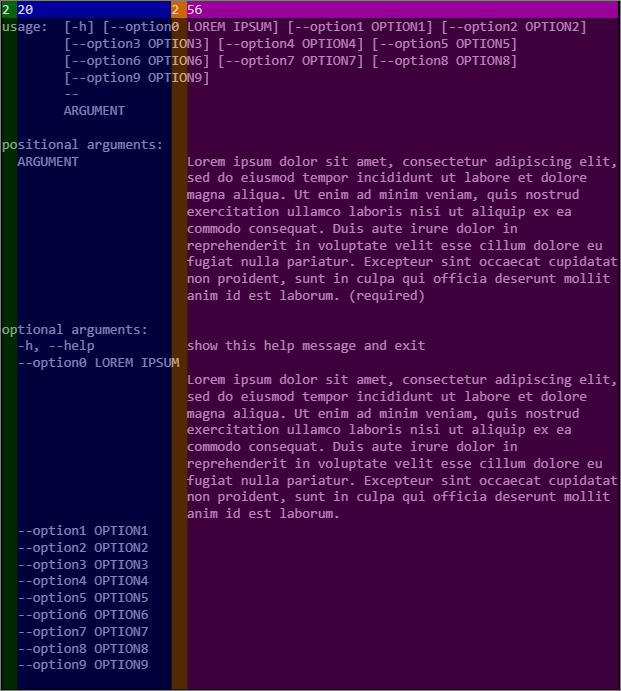
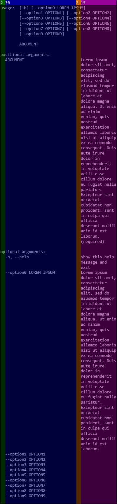
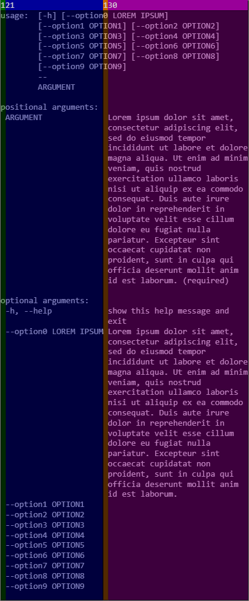

# Functions

## args_add_argument

Add a argument

|Option|Description|
|---|---|
|--action|Action append, count, store, store_true, store_false (default:store)|
|--choices|List of valid values (separate by spaces)|
|--default|Default value|
|--dest|Destination variable|
|--flag|Add a optional argument|
|--help|Usage helper|
|--metavar|Usage argument name (if not set use long/short name)|
|--name|Set the name of positionnal argument|
|--nargs|The number of arguments that should be consumed|
|--required|Is required if exists|

If error return 1.

```bash
args_add_argument [options...] -- [name/flags...]
```

### examples

```bash
# positional argument
args_add_argument -- "FOO"
# boolean optional argument
args_add_argument --action "store_true" -- "-f" "--foo"
# not boolean optional argument
args_add_argument --flag "-f" --flag "--foo" --action="store_false"
# optional argument
args_add_argument -- "-f" "--foo"
```

## args_parse_arguments

Use after args_add_argument functions.  
Convert argument strings to objects and assign them as attributes on the ARGS map.  
Previous calls to args_add_argument.  
determine exactly what objects are created and how they are assigned.  
Execute this with "$@" parameters.

If help option is called return 64 (*exit code*) else if error return 1 (*exit code*).

### example

```bash
args_parse_arguments "$@"
```

## args_set_description

Set a usage description.  
Concat all arguments.

### example

```bash
args_set_description "your description" "message"
```

## args_set_epilog

Set a epilog description.  
Concat all arguments.

### example

```bash
args_set_epilog "your epilog" "message"
```

## args_set_usage_width

Set the widths of usage message.

|Parameter|Description|
|---|---|
|$1|padding|
|$2|argument|
|$3|separator|
|$4|help|

```bash
args_set_usage_width 2 20 2 56
```

Set the usage witdhs.


```bash
args_set_usage_width 2 20 2 56
```



```bash
args_set_usage_width 2 30 2 15
```



```bash
args_set_usage_width 1 21 1 30
```



## args_set_usage

Set a full usage message.  
Concat all arguments.

### example

```bash
args_set_usage "usage: my_prog [options...]" " -- " "[args...]"
```

## args_set_alternative

Set alternative mode for getopt.

### example

```bash
args_set_alternative "true"
```

## args_usage

Show/Generate usage message.

|Parameter|Description|
|---|---|
|$1|Name/Path of script|

### example

```bash
args_usage "foo.sh"
```

## args_clean

Clean all map and array for recalled.

### example

```bash
args_clean
```

## args_debug_values

Show all values of arguments and options.

### example

```bash
args_debug_values
```